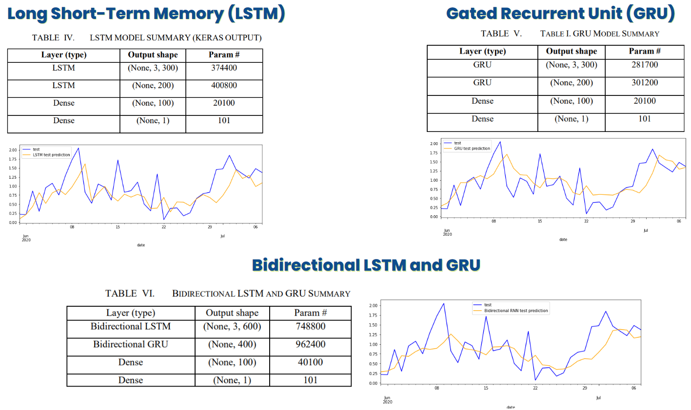
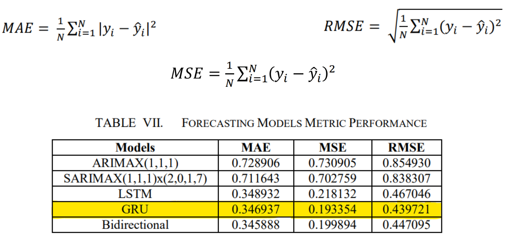

# Multivariate Time Series Electricity Consumption Forecasting using ARIMAX, SARIMAX, and RNN-based Deep Learning Models

- Promoted energy conservation by developing time-series forecasting models to forecast daily-average electricity consumption patterns of a residential household.
- Incorporated weather variables and day category (weekday, weekend, vacation day, and COVID lockdown) in the prediction process.
- The optimal model is a RNN-based model (GRU) with **MSE ~ 0.44**.

## Methodology

### Dataset
- The dataset is from [Kaggle](https://www.kaggle.com/datasets/srinuti/residential-power-usage-3years-data-timeseries) and contain hourly electric energy consumption (kWh) from January 2016 to August 2020 of a two-storied house located in Houston, Texas.
- The dataset also includes historical **weather reports** and **day category** (weekday, weekend, vacation day, and COVID lockdown).

### Exploratory Data Analysis
- The dataset’s frequency was converted into the daily frequency to simplify the forecasting task. This led to the downsampling of the dataset from hourly electricity consumption to daily-average electricity consumption
- As seen seasonal decomposition graph, **seasonality** is present in the  time series, that is, every year, **highest consumption can be observed around February to November**, which also happens to be the summer season of Houston, Texas.

- The electricity consumption for the current dataset is **correlated** with weather-related variables (e.g. as temperature increases, consumption increases).
- Power consumption is highest during weekends and lowest during vacations.

### Data Preprocessing
- **Standardization feature scaling** is used for the numerical features to have the same scale (mean of 0 and standard deviation of 1) and improve the training performance of the forecasting models.
- Forecasting models are generally unable to work with categorical data, **one-hot encoding** is used to transform the day categories feature into a one-hot vector of binary values 0 and 1.

### Modeling
- ARIMA and SARIMA models are statistical models for analyzing and forecasting time-series data. Their so-called "MAX" variants (ARIMAX and SARIMAX) of both models are used to account for the exogenous variables.
- The auto_arima API from the Pmdarima library is used to automate the optimal ARIMAX and SARIMAX model selection. From the respective PACF and ACF plots 
of the 1st difference of the time series data.  incorporating at least 6 lags  for AR (p) component and 7 lags in the MA (q) component may improve the predictive prowess of both the ARIMAX  and SARIMAX models. Because of this, the maximum AR and MA components in Pmdarima auto_arima are set to these  two numbers, respectively.
- After auto_arima training, the ARIMAX (1,1,1) model yielded the lowest OOB (out-of-bag) sample score and, thus, based on auto_arima, is the optimal ARIMAX model. For the SARIMAX model, on the other hand, the SARIMAX (1,1,1) x (2,0,1,7).

- One class of deep learning is the recurrent neural network (RNN) where connections between nodes can create a cycle, allowing output from some nodes to affect subsequent input to the same nodes.
- With this, RNNs are perfect to use with sequential data such as time series data. So, for the current task at hand, we used LSTM, GRU, and Bi-directional LSTM and GRU models with the following hyperparameters:
  - LR=0.001
  - Loss Function=Mean Square Error (MSE)
  - Model Checkpoint and EarlyStopping to avoid overfitting

### Results
- GRU model yielded the lowest MSE and RMSE on the testing dataset though it can also be seen that it only performs slightly better than the other two RNN-based models, so one may opt for the other RNN-based models also. 
- Nevertheless, RNN-based models are better predictors than the traditional ARIMAX and SARIMAX models, as implied by the 38 days daily-average power usage forecast graph and performance measures.

## Collaborators

